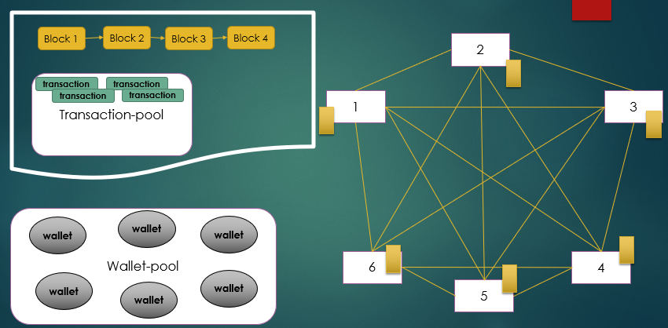
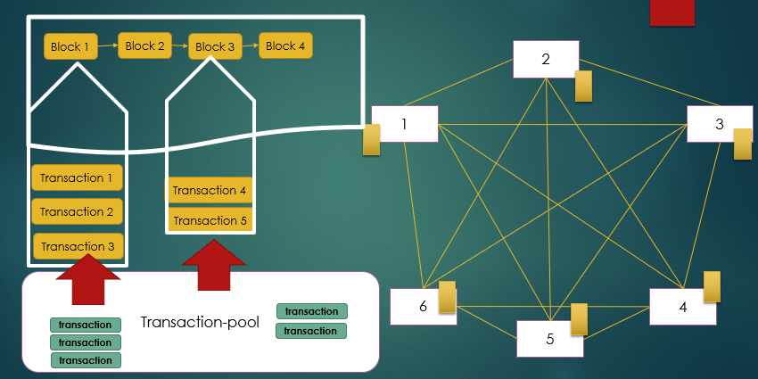

# Bitcoin-Simulation

Bitcoin-Simulation is a NodeJs sample for blockchain. The sample has been created for somebody who wants to know how blockchain actually works behind the scene. 

## Installation

Use the [npm](https://www.npmjs.com/) to install Bitcoin-Simulation.

```bash
npm install
```
## Documentation
This source simulates following parts of Bitcoin network:
- Creation wallets in secure way using Elliptic curve and Sha256.
- Creation wallet-pool to store all wallets in it.
- Creation transactions from a valid wallet to another valid wallet with specified amount.
- Creation transaction pool to let miners grab some of them to verify.
- Creation Proof of work, to find a valid hash for miners.
- Mining a new block and add it to blockchain.
- Creation distributed blockchain network.
- Keeping sync all transactions over the distributed network.
- keeping sync all created block over the distributed network.
- Consensus algorithem to verify all blockchain.





## Contributing
Pull requests are welcome. For major changes, please open an issue first to discuss what you would like to change.

Please make sure to update tests as appropriate.

## Gratitude
Thanks to [Dr. Ehsan Malekian](https://khu.ac.ir/cv/316/)